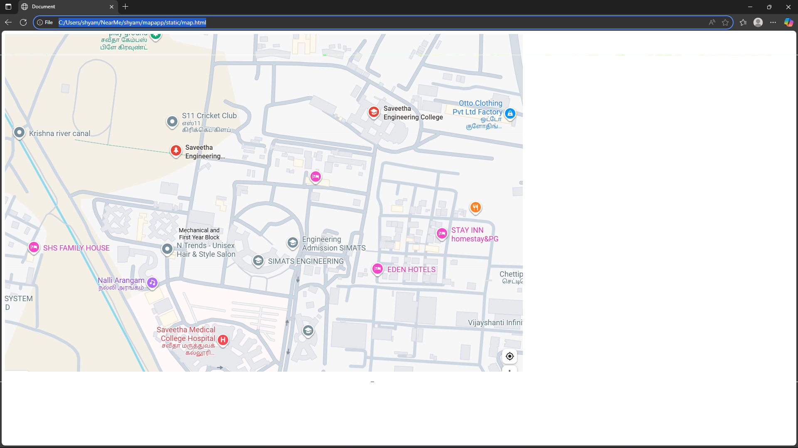
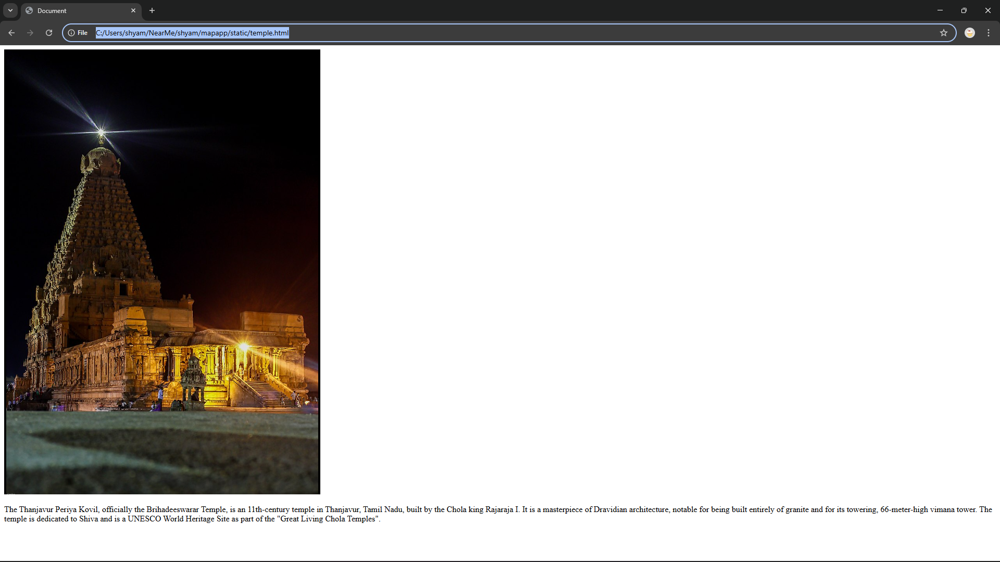
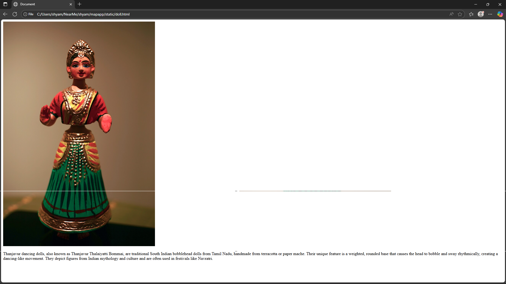

# Ex04 Places Around Me
## Date: 

## AIM
To develop a website to display details about the places around my house.

## DESIGN STEPS

### STEP 1
Create a Django admin interface.

### STEP 2
Download your city map from Google.

### STEP 3
Using ```<map>``` tag name the map.

### STEP 4
Create clickable regions in the image using ```<area>``` tag.

### STEP 5
Write HTML programs for all the regions identified.

### STEP 6
Execute the programs and publish them.

## CODE
```
<!DOCTYPE html>
<html lang="en">
<head>
    <meta charset="UTF-8">
    <meta name="viewport" content="width=device-width, initial-scale=1.0">
    <title>Document</title>
</head>
<body>
    <!-- Image Map Generated by http://www.image-map.net/ -->


<map name="image-map">
    <area target="" alt="forest" title="forest" href="doll.html" coords="1446,522,1539,556" shape="rect">
    <area target="" alt="temple" title="temple" href="temple.html" coords="1223,590,1169,544,1220,541,1258,564,1241,616,1183,621,1163,584,1169,539" shape="poly">
</map>
</body>
</html>
```

## OUTPUT






## RESULT
The program for implementing image maps using HTML is executed successfully.
